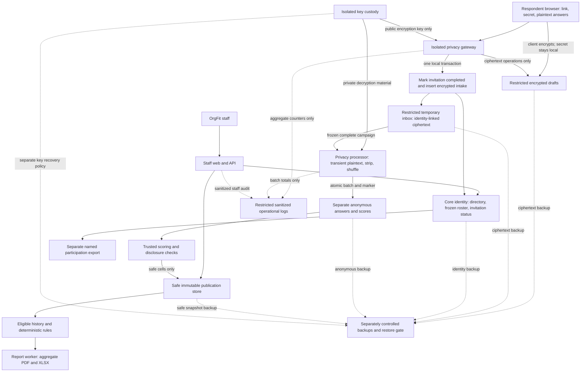

# OrgFit architecture analysis — Phase 00

Date: 2026-09-08 · Status: COMPLETE (design analysis only)

## 1. Scope, evidence and reconciliation

The baseline is [blueprint.md](blueprint.md), read in full, and the Project Brief and Phase 00 in [implementation-prompts.md](implementation-prompts.md). AGENTS.md, README.md, decisions and phase status were inspected before editing. This phase creates documentation only. Phase 01 remains a separate schema/API/privacy design work order.

Repository inspection found a documentation-only repository on `main`, at `95c72fa` (Initialize OrgFit blueprint and phased implementation workflow), with no configured remote. Tracked files are `.gitignore`, `AGENTS.md`, `README.md` and the four baseline documents. There are no source modules, package manifests, dependency locks, migrations, database configuration, test suites or deployment files. No database connection was attempted. This is absence of repository implementation, not proof about unrelated infrastructure outside this repository.

Two pre-existing untracked owner files must be preserved: `OrgFit-Master-Blueprint.md` and `OrgFit-Astra-6-Implementation-Prompts.md`. SHA-256 comparison showed the root blueprint identical to the canonical copy. The prompt copy differs only in the canonical document's added session-continuity guidance and Project Brief heading. Use the canonical docs paths; do not overwrite or delete the supplied originals. Git reported a permission warning reading the user's global ignore file, but repository status, tracked-file and hidden-file inventory succeeded. No functional modules exist to preserve; all supplied planning files and project instructions are preserved.

All 18 binding requirement IDs have a design owner and future verification path in [requirements-traceability.md](requirements-traceability.md). None is claimed implemented. The baseline is internally workable under its stated trusted-processor model. No product requirement change is needed. Important refinements are documented below and in [decisions.md](decisions.md): every organization-owned privacy record also needs organization scope even where entity tables abbreviate it; unpublished result candidates must not make protected values readable by staff; framework audit defaults must exclude invitation completion and anonymous rows.

## 2. Recommended stack and official-source verification

No working stack needs replacement. Recommend a TypeScript modular repository with separately built staff and survey applications and independent privacy/worker processes. Self-hostable Node processes/containers avoid requiring a particular hosting vendor. These are development defaults, not a deployed or compatibility-tested installation.

| Area | Development recommendation and evidence checked on 2026-09-08 |
|---|---|
| Runtime | Node.js 24 LTS; the official [release schedule](https://github.com/nodejs/Release) lists 24.x as Active LTS until October 2026, with support through April 2028. Recheck before dependency installation. |
| Web | Next.js 16.x, React and TypeScript at compatible stable versions. The [support policy](https://nextjs.org/support-policy) lists 16.x Active LTS and 15.x Maintenance LTS. [Installation documentation](https://nextjs.org/docs/app/getting-started/installation) specifies Node >=20.9 and TypeScript >=5.1. Node 24 meets that floor. Resolve React peer dependencies together with the chosen patched framework release. |
| Database | PostgreSQL 18, separate core and anonymous databases. The official [version table](https://www.postgresql.org/support/versioning/) lists 18 as supported through November 2030 (18.6 at inspection); use the latest supported patch when implementation begins. PostgreSQL 17 is a supported fallback if provider constraints require a recorded change. |
| Queries/migrations | Kysely typed queries and reviewed SQL migrations. [Kysely documentation](https://www.kysely.dev/) supplies PostgreSQL support and migration primitives. Explicit SQL is useful for grants, scoped foreign keys, row policies and lock order; types do not replace runtime authorization. |
| Durable work | pg-boss in restricted PostgreSQL queue schemas, with distinct operational and privacy queues/credentials. Its [maintainer documentation](https://github.com/timgit/pg-boss) requires Node >=22.12 and PostgreSQL >=13, compatible with the proposed majors. Treat delivery as retryable; enforce domain idempotency independently. |
| Staff identity | OIDC provider enforcing MFA and administrator-provisioned membership, with [openid-client](https://github.com/panva/openid-client) as the maintained protocol client candidate. Provider and recovery policy are production inputs; OrgFit keeps server-side membership, capabilities and revocable sessions. No homegrown password/MFA service. |
| Draft/intake crypto | Browser Web Crypto authenticated encryption candidate for drafts; libsodium sealed boxes candidate for encryption to the processor's public key. [Web Crypto](https://www.w3.org/TR/webcrypto/), [libsodium bindings](https://doc.libsodium.org/bindings_for_other_languages) and [sealed boxes](https://doc.libsodium.org/public-key_cryptography/sealed_boxes) provide standard primitives. Sealed boxes do not authenticate a sender: session validation and trusted intake writes remain necessary. Exact formats, binding, key rotation and lifecycle require Phase 01 design and independent production review. No custom cryptographic construction is selected here. |
| Storage/reports | Private S3-compatible storage behind an adapter; browser-rendered PDF using [Playwright page.pdf](https://playwright.dev/docs/api/class-page#page-pdf), XLSX using [ExcelJS](https://github.com/exceljs/exceljs). These sources establish capabilities, not proof of Arabic rendering or a long-term support guarantee. Actual fonts, workbook leakage and output fidelity need Phase 11 tests. |
| Testing | Pure deterministic unit/property tests; real PostgreSQL integration; Playwright browser journeys; report artifact inspection; fault/load tests. Exact test-library releases are selected with the foundation lockfile. |

Major support and documented capabilities were checked; packages were neither installed nor tested together. Libraries without an explicit LTS policy are candidates, not certified supported dependencies. Phase 02 must resolve exact stable patch versions, peer dependencies, licenses and security advisories, record them in a lockfile, and run build/integration checks. No invented patch pins, canary releases or implicit auto-upgrades. A future framework/provider change requires a decision and compatibility review; no data migration is needed for this recommendation today.

## 3. Modules, deployment units and dependencies

| Deployment identity | Modules / dependency direction | Permitted data paths |
|---|---|---|
| Staff web/API | Access, directory/import, instruments, campaign control, safe results/history, recommendation actions, visits and report requests | Approved core tables/views and safe publication data. No draft/inbox or anonymous credentials. |
| Public survey origin | Instrument rendering, encrypted save/resume, review and acceptance UX | Public gateway only; no database, staff cookie, directory metadata or analytics scripts. Separate build allowlist for public definitions. |
| Privacy gateway | Invitation exchange/session, draft ciphertext, server validation, atomic acceptance | Narrow invitation/campaign context and restricted core intake schema. Encrypt-only access for processor envelopes; no processor private key or anonymous database reads. |
| Privacy processor/scorer | Closure reconciliation, complete-batch mixing, scoring, disclosure plan, safe snapshot handoff | Restricted frozen intake, sanitized manifests, isolated anonymous database, processor key access, controlled publication writer. No routine directory browsing. |
| Operational workers | Scheduler, directory import, private participation/link export, visit scan/retention | Separate capabilities/credentials per job type; no universal worker with every credential. Scheduler closes through the same lock contract as finalization. |
| Report worker | PDF/XLSX from safe immutable snapshot and approved report manifest | Safe snapshots and report namespace only; no private directory, intake, anonymous answers or visit attachments. Organization title/period and safe participation totals arrive in the approved manifest. |
| Restricted operations | Migrations, backups/restores, key custody, security monitoring | Separate privileged deployment identities, unavailable to application roles or the OrgFit Super Admin UI. |

Shared code may include versioned scoring math, declarative validation, localization and semantic theme tokens. The synthetic scoring preview runs the same pure engine on synthetic answers. Sharing code does not share credentials: enforce dependency boundaries to keep staff-only metadata and server secrets out of the public build. Privacy processing is a separate trust/deployment boundary, not just another route in the staff server. A small number of deployment units is sufficient; no service per table is needed.

Campaign/instrument manifests supplied to processing contain only frozen organization/campaign/version/group definitions, not rosters. Results, recommendations, comparisons and reports depend only on released safe cells. Visits are confidential identified consulting records, separate from survey processing, with no links to raw answers. Global OrgFit templates are explicitly global; organization-owned copies require organization authorization.

### Organization and staff authorization

Super Admin manages staff, capabilities, assignments, policies and audits, and accesses all organizations one context at a time. Staff requires an assignment plus the relevant capability: `directory.manage`, `instruments.manage`, `campaigns.manage`, `participation.read`, `participation.export`, `results.read`, `reports.manage`, or `visits.manage`. Reports require both reports and results access. Global instrument permissions never imply access to an organization's campaign or results. Neither role can read raw answers/drafts or bypass the minimum threshold. Respondents authenticate only an invitation session, never a staff account.

Resolve organization from an authorized resource/session, reject conflicting client IDs, and reauthorize reads, writes, downloads and job execution. Use non-null organization IDs, composite scoped foreign keys, bounded queries and organization-aware cache keys. This applies also to drafts, inbox, jobs, anonymous answers/scores and publications; child organization scope must agree with the parent. Clear selection/form/cache context on organization switching. Runtime database roles are non-owner without BYPASSRLS; FORCE RLS is defense in depth, not protection against database administrators. Revocation must affect sessions and pending work, and downloads must check current access. Prefer authenticated file streaming to a reusable URL that outlives permission revocation. Phase 01 specifies exact grants and policies.

## 4. Data flow and trust diagram

The browser-to-draft arrow denotes encryption in the browser; all persistence passes through the gateway, never direct database access. Keys and backups are distinct access domains despite the compact diagram. No finalized answer edge points to an invitation, envelope or participant.

### Where identity context and plaintext can coexist

| Location | Exposure and required containment |
|---|---|
| Respondent browser | Link/session, private resume material and plaintext necessarily coexist. Shared-device storage, extensions, XSS or modified survey JavaScript can expose them. No third-party code or session replay; no recoverable server draft key. Local encryption is not protection from a compromised browser. |
| Public TLS termination / gateway request handling | Finalization sends plaintext over TLS with an invitation session. Any proxy terminating TLS, WAF body inspector or gateway instrumentation can observe the association. Host this path within the trusted privacy operations boundary; disable payload capture, trace correlation and sensitive crash dumps. |
| Gateway validation/encryption memory | Invitation context and answers coexist until encryption and acceptance complete. Never put payloads into generic queues, idempotency caches or staff error trackers. Managed-runtime memory erasure is not an absolute guarantee. |
| Processor decryption/mixing memory | Inbox metadata identifies invitations while envelopes are decrypted. Strip metadata before assigning new random output IDs and do not retain an input/output map, serialized intermediate file or debug dump. Infrastructure compromise remains outside the baseline guarantee. |
| Privileged recovery or key misuse | An operator combining intake backups with usable processor keys could reconstruct identity-linked plaintext. Separate custody, access approval and backup-safe deletion are required; restored data stays inaccessible until tombstones/retention are reapplied. |

The intended persisted core association is identity plus ciphertext only. Anonymous prose may itself name someone: absence of identifiers in the schema does not remove semantic identification. No plaintext-bearing logs, APM traces, SQL parameters, exported work files, swap/core dumps or object metadata may create a durable bridge. Deployment verification must inspect the entire request path and backup policies, not only application logging settings.

## 5. Invitation, draft and finalization analysis

Links use at least 256 random bits and keyed digests with key versions. Generate/display once; manual copying/export only. A fragment token is exchanged via POST then removed from browser history. Use short-lived Secure/HttpOnly cookies, no-referrer/no-store responses, origin/CSRF checks and no public request correlation ID flowing into processing. Rate-limit with short-lived abuse state that does not become respondent tracking.

The original bearer link authenticates an invitation but cannot decrypt an existing draft. Browser-generated independent high-entropy resume material encrypts drafts; the server stores an invitation-bound random handle, ciphertext and revision. Cross-device recovery requires the private resume code and a valid invitation session. Same-device resume uses locally held material with an explicit shared-device warning. Lost secret means a confirmed start-over invalidating the previous draft, never staff recovery. A copied link can still enable impersonation or denial of progress; accountless bearer access does not prove which human submitted. Private draft encryption protects confidentiality, not the legitimacy of a bearer. Rotation invalidates tokens and existing sessions; finalization makes drafts inaccessible. Stale revisions produce conflict, not silent overwrite.

Finalization takes the campaign lock before the invitation lock in one core database transaction. Recheck OPEN, server/database time, current token generation, READY, frozen version/group and all answers under that lock. Start is inclusive; end is exclusive; no end stays open until closure. Closure/cancellation/end-date mutations use the same ordering. An expired campaign cannot be extended back into accepting even if the scheduler is late.

Validate first; invalid answers never consume the link. Persist an encrypted envelope and COMPLETED atomically, with a unique invitation inbox constraint. Delete the colocated draft in that transaction (recommended v1 storage), and clear local material after acceptance. Return success only after durable commit. The status means accepted, not analyzed. Retries return generic accepted status without payload comparison, answer IDs or replacement. There is no cross-database dual write at acceptance and no per-person completion timestamp in staff-visible audit/update metadata.

| Failure point | Required recovery and publication consequence |
|---|---|
| Validation/encryption or transaction fails before commit | No completion and no durable envelope; retry possible while eligible. Never return accepted. |
| Commit succeeds, reply is lost | Invitation status resolves uncertainty; repeated POST cannot replace the first payload. |
| Queue enqueue fails after acceptance/closure | Reconciliation finds committed pending work; a queue message is a wake-up hint, not proof of acceptance. |
| Processor fails before anonymous commit | Restricted input remains; retry the same frozen batch. No visible partial answers/results. |
| Anonymous commit is uncertain or succeeds before cleanup | Query the stable batch marker before processing again. Marker and answers commit atomically; resume cleanup rather than append a duplicate batch. |
| Cleanup/key deletion fails | Keep recovery state restricted, alert and gate release on verified cleanup/privacy checks. Do not claim crypto-erasure while keys remain recoverable. |
| Counts differ, key is missing or accepted input is corrupt | Block publication, alert, preserve incident evidence safely. Never mark participants incomplete or silently omit accepted data. |
| Restore has stale core/anonymous backups | Reconcile accepted counts, batch markers and deletion tombstones before access; missing committed intake is a data incident. No automatic reopening or replay into duplicate answers. |

Closed campaigns freeze the whole accepted set. Fewer than five accepted submissions yield only an insufficient/suppressed result state; do not decrypt for staff results and purge according to the short approved retention window. Eligible batches strip transport/identity fields, retain only approved coarse group/version context, shuffle and use fresh random non-time-ordered IDs. Large-batch staging stays restricted until one atomic visibility marker. Batch-level ID/count/manifests are allowed; per-envelope output mappings and copied checksums are not. Completion remains true after inbox cleanup, so later reconciliation uses campaign-level evidence rather than expecting permanent inbox rows.

## 6. Publication, measurement and disclosure

Freeze roster, instrument, group labels, notice, language availability and privacy threshold at launch. Department changes/additions later cannot alter the round. Single-person, selected-set and department targeting are valid; one campaign per round, deduplicated roster. Do not revoke completed invitations to remove an unknown answer. Repeated measures create new rounds; closed/cancelled campaigns never reopen.

Scoring is a pure versioned function with decimal precision: bounded min-max normalization, reverse before aggregation, defined weights/coverage, complete inputs for sums/fixed-denominator percentages, and explicit overall direction. A 1–5 answer of 4 is 75. Group means give each valid respondent equal weight, not each department. Missing optional answers are not zero. Interpret before display rounding and keep immutable version manifests. No unconfigured universal health score or scientifically validated-template claim.

Only closed reconciled batches may produce a release. Count valid distinct contributors separately for every metric/bin, minimum five even at company level. Null out protected values and counts before writing anything staff-readable; CANDIDATE status alone is not an access barrier. Keep unsafe intermediate calculations in the privacy boundary. Recommendations, risk badges, ranks, gaps and report metadata must not expose more precision or evidence than the approved release permits.

Use company plus one disjoint flat department partition only. If any nonempty department has fewer than five valid contributors for a metric, withhold the entire department breakdown for that metric; company may still be eligible. In the 10+2 case publishing both company and the ten-person group's mean reveals the two-person residual. Include unknown departments and missingness in this review. Reject alternate partitions, hierarchy rollups, submission-time filtering, respondent exclusions and arbitrary slices.

Question bins require their own protection; checkbox denominators are distinct respondents, not selections. Predetermined safe bin combinations only; otherwise suppress distribution/complementary totals. Homogeneous sensitive endpoints can reveal everyone's value even at n>=5 and must be withheld. Text and exact dates are collected but default to no staff qualitative output, no verbatim quotes and no individual export. No optional qualitative review feature is being added in v1 by this analysis.

A release plan must consider all cells jointly: totals, dimension/overall algebra, bins, missing counts, tooltips, rule outputs, prior revisions and comparisons can reconstruct hidden results. Company-only is not automatically safe if a company overall and other dimensions reveal a hidden dimension. Conservative default: withhold implicated additional outputs when reconstruction safety is uncertain. Phase 01 specifies the release contract; Phase 08 implements and Checkpoint D adversarially tests the algorithm. No claim that a complete disclosure algorithm has already been proved.

Publish one fixed reviewed snapshot per campaign. Corrections require a recorded new revision and disclosure review against already released data; stronger privacy policy must not automatically unhide prior suppression. Revocation can stop future downloads but cannot recall copies. Historical comparisons stay within an organization, require IDENTICAL or explicitly REVIEWED_EQUIVALENT measurements, and preserve original populations, groups, engine/rule/privacy versions. Stable keys alone do not establish equivalence; mergers/splits block automatic department comparisons. Missing/suppressed points remain gaps. Point changes are direction-aware; no cross-round respondent join. Near-identical populations and external knowledge remain inference risks even across otherwise compatible rounds.

## 7. Keys, logs, retention and production trust

| Asset | Intended access and lifecycle |
|---|---|
| Token digest/session keys | Gateway and narrowly scoped invitation issuance function, through managed secrets; no UI display. Distinct from draft and processor keys. |
| Draft secret | Respondent only; never server logs, database or staff recovery. Browser storage policy and cryptographic format finalized in Phase 01. |
| Processor temporary private material | Separately operated processor; gateway gets encryption-only material. Phase 01 must define campaign/batch key scope, authentication of key distribution, rotation and deletion evidence. A wrapped key in a backup with a still-usable wrapping key is not erased. |
| Core/anonymous/storage encryption keys | Separate service/backup grants, migration identities and recovery custodians. Core application operators must not inherit processor key access. |
| Logs | Staff sanitized audit is distinct from public aggregate counters. No token/body/bind-parameter recording, survey session replay, precise completion events or identity-to-answer distributed tracing. Infra network metadata access and TTL must be documented. |
| Backups/restores | Separate data and key policies; encrypted restricted backups, deletion tombstones reapplied before access, timed reconciliation/restore exercises. No production data in development. |

Use the blueprint's durations only as proposed nonproduction planning defaults: drafts on submission or within 7 days after closure; manual link exports 24 hours; processed intake immediately after verified transfer; sub-five intake within 30 days of closure; anonymous answers 12 months; security/audit 12 months; rolling backups 35 days. Aggregate/consulting retention requires a business schedule. Draft expiry for indefinitely open campaigns needs an explicit bounded TTL/renewal contract in Phase 01; no indefinite accumulation by omission. RPO <=15 minutes and RTO <=4 hours are targets pending measured infrastructure evidence.

The baseline promises no retained direct identity link in finalized storage, no application-staff raw-answer/decryptable-draft access, and controlled aggregate disclosure under trusted gateway/processor/infrastructure operation. It does not promise mathematical anonymity, differential privacy, resistance to malicious processors or colluding infrastructure operators, protection from browser compromise, or immunity to self-identifying prose/background knowledge. Named completion lists already disclose participation. Staff cannot delete an individual's final answer by identity because no lookup exists; governed whole-campaign erasure is separate from directory erasure/archive.

Production requires independent privacy/security review of the protocol, browser code delivery, actual grants, cryptographic implementation, key custody, transient processing, logs, WAL/backups, crash recovery and output inference. Owner acceptance of the exact threat model and notice is separate from that technical review. A stronger adversary model requires an independently designed audited anonymous-credential/mix solution and new review, not a stronger marketing claim about this architecture.

## 8. Phase dependencies and practical verification plan

This is execution order, not permission to start the next phase. Checkpoint C blocks downstream real data; later checkpoints are also mandatory. Localization starts in 02; 13 refines it. Isolation is exercised at every phase, not just A. Report work depends on safe publication and compatible history; the report worker never gains raw access to compensate for missing contracts.

All future fixtures are synthetic. Create organizations A/B with overlapping private participant codes and department names, different IDs, A-only/B-only staff, a dual-assigned staff member and Super Admin. Include revoked capabilities, disabled accounts, foreign-resource substitution and reused pooled database connections. A has a 10+2 department fixture; B has independently scoped rounds. Add separate rounds with 1, 4, 5 and 20 completions, five total but four valid for a metric, unknown departments, sparse bins, checkbox overlap and homogeneous endpoints. Never combine organizations to meet a threshold.

| Gate / phase | Planned evidence, not run in Phase 00 |
|---|---|
| 01 | Entity and actual-role grant matrix, state/lock walkthrough, no forbidden response fields, all public/staff API error and idempotency contracts, crash table and release review. |
| 02–03 / A | Real PostgreSQL role/RLS/FK tests, pool context reset, every endpoint/job/file cross-org substitution, revocation, import dry-run and idempotency, fresh/upgrade migrations. No SQLite substitute. |
| 04–05 / B | All 12 listed builder types round-trip, required defaults, no branching, immutable copies/versions; golden math 75, 83.333333, 81.25, 75 sum, 80 percentage, 78 overall and 60 contributor-weighted company; property tests for reverse/weights/bounds and full-precision bands. |
| 06–07 / C | Single/selected/department targets, frozen roster, exact start/end and no-end, rotation invalidates sessions, original link cannot decrypt, cross-device secret resume, stale drafts; 100 concurrent final attempts yield exactly one immutable accepted payload; fault injection at every commit/cleanup boundary and mapping/log search. |
| 08–09 / D | Per-metric n=4/n=5, 10+2, homogeneous/sparse/checkbox cases; algebraic reconstruction across totals/dimensions; no leak in charts/caches/serialized props/recommendations; no live scores or unsupported filters. |
| 10–11 / E | Identical/equivalent/incompatible instruments, direction flip, rename/move/merge, zero baseline and missing rounds; dashboard/PDF/XLSX equality, hidden workbook/chart data and formula injection, real Arabic page rendering, revoked/expired downloads. |
| 12–13 / F | Visit transitions, same-org links, malicious/mislabeled/oversized files, scanner outage; full AR/EN staff/respondent journeys at 320px/200% zoom, keyboard/screen reader, slow/offline/save conflict and lost acceptance response. Real iOS Safari/Android Chrome checks reported separately from emulation. |
| 14–15 / G | Actual log/key/backup access review, duplicate/dead-letter jobs, tombstone replay, timed restore/rollback proving no reopened invitation or lost accepted payload; scans and alert drills. Load with 100k directory rows, 10k invitees, 200 items and 200 sessions; measure p95 page/API <2s, durable acceptance <3s excluding network and agreed report <2min with hardware/fixture stated. |

## 9. Risks, remaining inputs and Phase 01 readiness

No unresolved contradiction blocks Phase 01. High-consequence design work remains intentionally for that phase: exact DB privileges and scoped child keys; crypto formats/key lifecycle; campaign lock compatibility; cancellation/expiry/draft retention; batch recovery reconciliation; and joint disclosure rules. These are design deliverables, not hidden production assumptions. Phase 02 must wait for the Phase 01 review.

Production inputs P-001 through P-008 are tracked in [decisions.md](decisions.md), with owners and gates: threat model/notice and independent review; provider/region and domains; processor/key custody; retention/recovery; staff identity bootstrap; approved instruments/translations/scoring/rules; import/contact/content policy; and actual release evidence/authorization. None is represented as approved. Documentation checks are recorded in [phase-status.md](phase-status.md); there is no runtime, security or production verification yet.

**Phase 01 may proceed when explicitly requested. Stop after Phase 00.**
