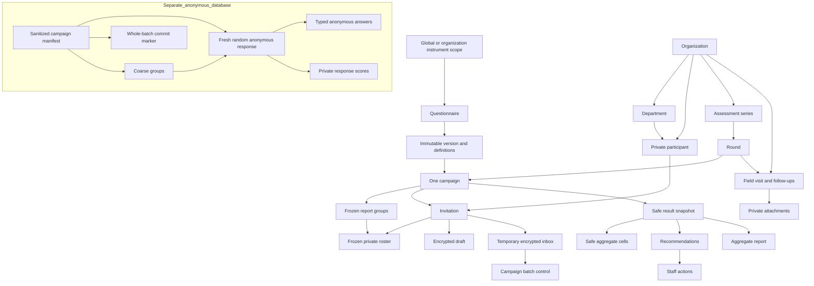

# OrgFit data model and database design review

2026-09-08 · Phase 01 · DESIGN COMPLETE, NOT IMPLEMENTED

The full physical field/constraint specification is [proposed-schema.md](proposed-schema.md), an equivalent schema draft rather than executable SQL. It includes every blueprint section 5 entity, explicit inherited columns/nullability, composite keys, indexes, deletion classes, JSON contracts and named cross-row guards. This separation avoids pretending a partial CREATE TABLE script is a deployable migration. No database, schema, runtime role or migration was created or tested in this phase.

## 1. Ownership and relationships

Core database schemas: `access` (staff identity), `core` (organization directory, campaigns, consulting), `instrument` (global/org definitions), `intake` (restricted public sessions, encrypted drafts and temporary ciphertext), `publication` (safe results/history/report metadata), `ops` (sanitized operational work). A separate database contains only `anonymous`. Queue library tables go in separate `queue_ops` and `queue_privacy` schemas, never PUBLIC and never used as answer storage.

The diagram shows relationships, not permission grants. The processor copies a sanitized manifest and safe results across boundaries using narrow contracts. There is **no edge from finalized responses to participants, invitations, drafts, tokens, sessions or input envelopes**. Campaign/group IDs identify cohorts, not an individual. Anonymous groups contain no directory department FK; labels themselves still require the documented small-group controls. Free text can identify its author semantically, so staff never receives it by default.

Blueprint entity names are preserved. Additional tables are operational necessities, not new product features: instrument_scope resolves global versus organization ownership; staff/respondent sessions support revocation; processing_batch/campaign_key support crash-safe encrypted intake; anonymous_group constrains grouping; report_comparison gives real same-org references; private_export separates named/link exports; staff_mutation gives safe mutation receipts; deletion_tombstone prevents retention rollback. No SaaS/account/billing entities are introduced.

## 2. Database-role access matrix

These are concrete proposed role names for future migrations and deployment credentials. They are **not existing grants**. All login runtime roles have NOSUPERUSER, NOCREATEDB, NOCREATEROLE, NOREPLICATION, NOBYPASSRLS, and own no tables/schemas/functions. Separate NOLOGIN ownership roles: `orgfit_core_owner`, `orgfit_anon_owner`; migration credentials may explicitly SET ROLE to only their own database owner, never used in application processes. No runtime membership in owner roles. Revoke PUBLIC schema creation, table access and default function EXECUTE. Database CONNECT is allowlisted by service and network identity; staff runtime cannot CONNECT to anonymous DB.

Legend: `R` authorized safe read; `DML` narrowly scoped typed operations; `X` execute only named guarded routine; `—` denied. No table-wide grant is implied by a family label. Routine owners are dedicated NOLOGIN, non-owner, non-BYPASSRLS roles with only necessary table privileges. SECURITY DEFINER routines fix search_path to trusted schemas, qualify objects, disallow dynamic SQL, recheck actor/org and are not PUBLIC-executable. Tables use ENABLE/FORCE RLS, including rows reached by routines.

| Runtime role | Access/directory | Instruments | Campaign / invitations | Intake | Anonymous DB | Safe publication / files |
|---|---|---|---|---|---|---|
| orgfit_staff | R authorized views; X staff/admin/directory/visit mutations | R authorized definitions; X draft/publish/retire | R campaign and participation projections; X launch/edit/close/revoke and private export request | — | — | R published safe views; X report request/comparison/action; authorized downloads via service |
| orgfit_auth | X staff lookup/session issue/revoke after validated OIDC; no directory | — | — | — | — | — |
| orgfit_issuer | X current actor authorization | R pinned public context only | X issue/rotate current READY invitation; receives generation metadata/digest write contract | — | — | X create short-lived encrypted link export manifest; no results |
| orgfit_gateway | — | R pinned public manifest via invitation session | X token exchange, session/context/status, guarded acceptance (completion only), request-time scheduling normalization | X create/save/resume/start-over; insert encrypted accepted envelope atomically; no processor decrypt key | — | — |
| orgfit_processor_core | — | R frozen full scoring manifest only | X freeze closed batch / reconcile aggregate completion count; no named list | R frozen ciphertext/key public metadata; X lease/mark cleanup/purge; key custody independently grants private use | Separate credential below | X write approved snapshot/cells/rule evidence and publish after guards; no direct staff API |
| orgfit_processor_anon | — | — | — | — | DML manifest/groups/whole anonymous batch and private scores; marker lookup; no row update after commit except append new score engine | — |
| orgfit_report | — | Only methodology in report manifest | — | — | — | R safe approved source through job-scoped routine; X own job state/artifact registration; report bucket write, no visit/link bucket |
| orgfit_scheduler | — | — | X advance due schedule/close via campaign lock | — | — | X enqueue campaign-level jobs; no answers or exports |
| orgfit_import | R assigned import validation references; X idempotent approved commit | — | — | — | — | Import temporary namespace only |
| orgfit_private_export | R approved directory/participation projection after requester reauthorization | — | R invitation reference/name/status only | — | — | Only directory/participation namespaces; link material generated by issuer, never raw answers |
| orgfit_scan | — | — | — | — | — | Read quarantine bytes; X attachment scan status; no results/directory |
| orgfit_retention_core | X approved class-specific purge, no broad SELECT | X eligible draft-definition purge if policy permits | X policy cleanup preserving completion invariants | X expiry/batch-confirmed purge; no decrypt | — | X expire artifacts and tombstones; bucket deletion by exact scoped manifest |
| orgfit_retention_anon | — | — | — | — | X whole-campaign tombstoned purge only | — |

`orgfit_processor_core` and `orgfit_processor_anon` are separate database credentials of the isolated processor deployment; staff/core operations never receive them. No ordinary analyst/scorer UI uses either. The processor is trusted and can see identity-linked ciphertext and plaintext transiently; this is not anonymity against that processor. Backup/restore and key-custodian roles are separately privileged operational identities outside the application matrix. Split core/anonymous backup credentials and key recovery authority; never grant OrgFit Super Admin database administrator permissions by virtue of the UI role.

### RLS and capability enforcement contract

For an organization-owned row, policy requires `row.organization_id = current authorized organization`, active staff subject/session, and assignment or SUPER_ADMIN; action capability is additionally checked by the routine/API. Global instruments require instruments capability for editing and explicit global scope; org-owned instruments require matching assignment. Organization listing returns authorized operational summaries only. Cross-org query results are never combined into assessment metrics.

Staff subject/org context is installed transaction-locally only after validated server session lookup, never from a browser header. Missing/malformed context denies access. Reused connections reset at transaction end. A shared application connection can technically set its context, so this is defense in depth against mistakes under trusted server code, not protection against a compromised application process. Gateway routines derive organization/campaign/invitation from the valid hashed session and current generation; they do not trust a caller's organization parameter. Worker routines resolve job ID to a same-org target and reauthorize the original requester when applicable; internal closure/retention jobs use narrowly scoped service policy, not a disabled staff user's authority.

Participation views expose participant ID/name/reference/status where authorized, but not token_digest, session rows, draft existence, ciphertext, admin-internal storage IDs or per-person completion time. Invitation base tables are not staff SELECT targets. Completion updates do not change M-style timestamps because invitations and rosters use I, not M. Audit includes issuance/revocation but no COMPLETED row history, per-person webhooks or finalization trace.

PostgreSQL superusers/BYPASSRLS and normally owners can bypass row policies; FORCE RLS is required for owner participation but is not immunity to administrators. This limitation is documented in [PostgreSQL row security](https://www.postgresql.org/docs/18/ddl-rowsecurity.html). Staff authorization and separate credentials remain primary controls.

## 3. Transaction and integrity ownership

| Guard / transaction | Authority and required effects |
|---|---|
| instrument_mutate / publish | instruments.manage plus scope; lock version before child writes; validate entire definition; hash/freeze atomically. Published children immutable at DB write boundary, not only hidden in UI. |
| campaign_launch | campaigns.manage plus organization; lock directory organization snapshot boundary, then campaign, then round; verify active nonempty targets and published accessible version; create immutable roster/groups and unique unissued invitations atomically. |
| campaign_control / accept | Follow [state-machines.md](state-machines.md) and [privacy-protocol.md](privacy-protocol.md); acceptance locks campaign before invitation; local ciphertext/completion/draft cleanup transaction. Never generic audit hooks. |
| frozen_batch / process | One stable batch per campaign; count reconciliation before decryption; atomic anonymous answers/scores/marker; cleanup proven before release. No distributed transaction pretence. |
| snapshot_publish | Only processor publisher; safe content only; validate matching manifest/count/review/key cleanup; snapshot and all cells atomic, recommendations complete before exposing release. One PUBLISHED revision; prior revision retained with correction record if replaced. |
| report_download | Staff service validates current results+reports capabilities, org access, published nonrevoked source, clean READY artifact and expiry on every authenticated download. Worker credentials alone cannot authorize a user's download. |
| retention_purge | Approved class policy/tombstone, restricted job, ordered cleanup. Identity erasure cannot locate final answers; no hidden back-reference is added. |

Organization deletion is not a v1 CRUD action. Archive prevents new campaigns/directory mutations while preserving historic reads and ongoing acceptance under the already launched contract; close/cancel active collection explicitly before governed erasure. Campaign launch directory consistency uses a common organization mutation lock: imports/participant changes affecting roster and launch serialize; finalization never takes a directory lock. Once a round has a campaign, round mutations also lock campaign before round; close/publish may update round only after campaign, never acquire directory/version write locks. Before a campaign exists, creation serializes on round and inserts its unique campaign; a concurrent duplicate creation fails uniqueness and rolls back, never locks an already-existing campaign while holding round. Instrument publish never acquires campaign/round locks; launch checks published/retired state without taking a conflicting version mutation lock, and existing launched references remain valid if retirement follows. Bulk operations lock multiple resource UUIDs in sorted order. Services must never hold an invitation lock and then seek its campaign lock.

## 4. Design review checklist and outcome

| Review item | Phase 01 disposition | Required implementation evidence |
|---|---|---|
| Every blueprint entity typed, nullable fields explicit, keys/indexes/retention assigned | Specified in proposed schema; static coverage check | Fresh/upgrade migrations and constraint tests in relevant phases |
| Global/org ownership and same-parent child references | Scope registry plus equality guard and composite FK rules specified | Cross-org and cross-version substitution failures under runtime roles |
| No finalized response-to-identity edge or generic response audit fields | Diagram and anonymous column allowlist specified; static check | C schema/credential/log/backup adversarial inspection |
| Minimum privilege and runtime roles distinct from owners | Named matrix, RLS and guarded routine contracts specified | 02/A real PostgreSQL grants, denied CONNECT and pool-context tests |
| Immutable instruments, roster, response payloads and released results | Write guards and revision contracts specified | B/C/D/E mutation attempts rejected |
| Start/end, close/finalization and retries | Linearization and database-clock decision specified | C 100-way submission and lock/fault tests |
| Private draft key, lost code, race, rotation and expiry | DF1 and session/handle contract specified | C/browser crypto known-answer and multi-device tests |
| Anonymous batch and key/backup lifecycle | Stable marker, cleanup and tombstone protocol specified | C/14 crash points, actual provider key windows and restore drills |
| Threshold/complementary/sparse/homogeneous/joint disclosure | Fail-closed release algorithm and safe-cell contract specified | D/E reconstructability and export structure tests |
| Staff/public endpoints, permissions, errors and idempotency | Complete endpoint families and shared DTO rules specified | API integration and browser journeys in owning phases |
| Production acceptance / independent review | NOT VERIFIED; P-001–P-008 remain open | Owner, independent reviewer and deployment operator evidence |

Review outcome: **Phase 02 may proceed when requested**, limited to its foundation scope. There is no unresolved baseline contradiction blocking foundation design. No migration, database policy, crypto pipeline or privacy claim is independently verified. Current accepted development decisions resolve open design questions; infrastructure-specific key destruction, jurisdiction/retention, provider credentials, approved content and production tests remain real-deployment gates. Exact patched dependencies must be checked before Phase 02 installs them. This handoff is not authorization to start Phase 02 automatically.
